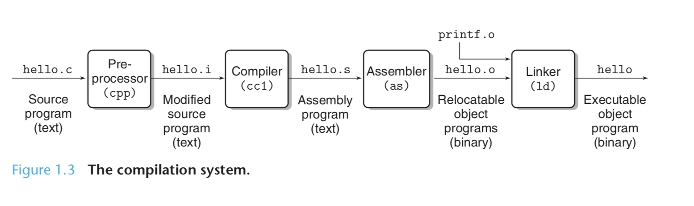

# Gcc and Makefile

> 周海沧
>
> 上海市数据科学重点实验室


## 1. GCC

### 1.1 From Coding to Running

大家大一的时候都上过 C 和 C++ 的课程，回顾我们编写程序的过程，我们首先需要在一个**文本编辑器**[Editor]中编写代码，然后我们通过**编译器**[Compiler]将写好的 C/C++ 代码编译成**可执行文件**[Executable File]；之后，我们就在操作系统上运行这个可执行文件。之前大家在 Windows 或者 MacOS 系统上进行编程的时候，大家使用的 IDE 把这些功能都集中在了一起；而在 Linux 中，我们需要在不同的阶段使用不同的软件。

上节课我们介绍了 `vi` ，这是一种系统自带的文本编辑器，在很多的场合，`vi` 是不可替代的。但是相对于大家而言，直接使用 `vi` 的学习曲线可能过于陡峭，因此对于这一门课，我们推荐使用图形化的文本编辑器，例如 [VScode](https://code.visualstudio.com)  [Sublime Text](https://www.sublimetext.com) 

编译是一个很复杂的过程，这里引用 CSAPP 第一章的 图1-3 如下



尽管现在你也许对这张图非常陌生，但随着课程的深入学习和在练习中的多次使用，相信你一定能够渐渐理解图中的每个部分的内容。

在 Linux 中，我们使用的编译器是 [GNU](gnu.org) 提供的 [GCC](https://gcc.gnu.org)。当然，对于 C 语言，你也可以尝试 [Clang](http://clang.llvm.org)。注意，同样的代码经过不同的编译器得到的可执行文件可能有不同的行为。

### 1.2 GCC Helloworld

这里我们简单地介绍一些 GCC 的命令。我们将编写一个 helloworld.c 程序，用 `gcc` 对其进行编译，并在 terminal 中运行这个程序，最终我们能够在 terminal 中看到 `Hello, world!` 这样的文字。

首先，在 terminal 里输入

```bash
gcc --version
```

此时你会得到关于当前系统默认 gcc 的版本信息。如果产生了报错信息，或者提示没有安装 gcc，请使用 `sudo apt-get install gcc` 进行安装。

之后，我们使用文本编辑器在一个目录下编写 `helloworld.c` 程序，例如，程序是放在 Documents 中的。

程序完成之后，我们打开 terminal ，将 terminal 切换到程序所在的目录下，例如：

```bash
cd $HOME/Documents
```

之后我们使用 `gcc` 编译这个程序，编译命令如下：

```bash
gcc helloworld.c -o helloworld
```

上面这行命令的格式其实是

```bash
gcc <source_code> -o <output_file>
```

`-o` 表示输出文件名。

这样，我们就可以在 terminal 中输入

```bash
./helloworld
```

来运行我们的程序了，这时你应该能够看到 terminal 中输出的文字。

### 1.3 More GCC Commands

对于 terminal 中的命令，我们可以通过

```bash
man <command>
```

在 terminal 中进行查阅。打开的内容是显示在 `vi` 命令模式中的，所以你可以通过 `vi` 的命令进行操作，例如：

| Commands | Meaning |
| :------: | :-------: |
| Ctrl + F | 向下翻页 |
| Ctrl + B | 向上翻页 |
| j | 向下移动一行 |
| k | 向上移动一行 |
| q | 退出 |
| / + \<target\> | 查找 |

关于 `vi` 中的查找，相对比较复杂，如果需要，请自行百度。

对于 `gcc` ，我们在 terminal 中输入

```bash
man gcc
```

这里我们列出了一些常用的 `gcc` 命令

| Commands | Meaning |
| :--------: | :-------: |
| -O / -O2 / -O3 | 优化编译 (数字表示不同到优化级别，数字越大，优化越高) |
| -S | 把文件编译成为汇编代码把文件编译成为汇编代码 |
| -c | 生成obj文件 |
| -g | 产生调试信息 |
| -w | 不生成任何警告信息 |
| -Wall | 生成所有警告信息 |
| -Werror | 把所有的warning当作错误 |


## 2. Makefile

Suppose you're writing some huge program with a bazillion files and headers. Wouldn't it be nice to somehow be able to compile the entire thing with a single incantation? (as opposed to typing `gcc -c fooX.c ...` for X in [0, 100])

Suppose you just edited one tiny header file. Wouldn't it be nice to be able to recompile only the files that are affected by the change?

Makefiles allow you to do precisely this. With only minimal knowledge of makefiles you can automagically recompile your program with the `make` command.

在短期内，我们还不需要自己为一个大型的工程写 Makefile，而在我们 labs 中，我们会为大家准备好 Makefile 大家需要了解 Makefile 的大致结构和使用方法。这里我们给出一个[链接](http://matt.might.net/articles/intro-to-make/)。如果你对于大型工程的维护没有概念，这没有关系，但是我们需要能够开始使用下面的这些命令：

```bash
make

make clean

make test

make install

make run
```


## 3. Reference

[1] CSAPP, 3ed

[2] Washington Univ, A Quick Introduction to Makefiles [link](https://courses.cs.washington.edu/courses/cse451/99wi/Section/makeintro.html) 

[3] A short introduction to make, [link](http://matt.might.net/articles/intro-to-make/) 

[4] 各种祖传slides